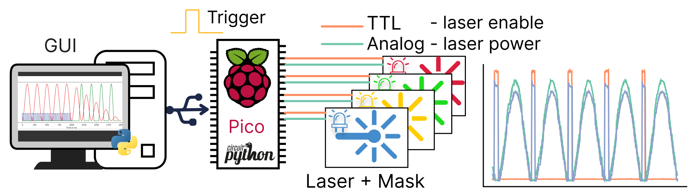

# FreiCtrl_Laser

Here we present a flexible, low-cost system based on the Raspberry Pi Pico microcontroller board
running CircuitPython. Designed for use in optogenetic experiments within behavioral paradigms, it can control
up to four lasers simultaneously through both analog and digital channels. 

Parameters can be flexibly configured via an intuitive graphical user interface [(GUI)](documentation/gui.md) or an Application Programming
Interface [(API)](documentation/uart_api.md). 

Built-in mask controller automatically generates signals to drive masking LEDs, preventing animals from associating
the laser with a visual cue. 

Read the [documentation](https://arturoptophys.github.io/FreiCtrl_Laser/).

## Installation
[Installation](documentation/installation.md)

## Hardware and build instructions
[Build instructions](documentation/hardware_circuits.md)

## Usage
[User guide](documentation/user_guide.md)

