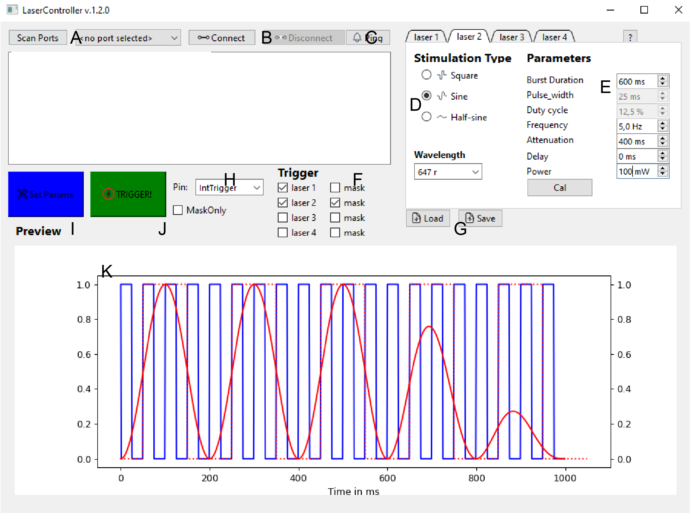

## GUI overview
We provide a GUI based on Python and PyQt6 which allows setting the parameters and visualizing the resulting stimulation
patterns. 

### Run
To start the GUI, run the following command:

```bash
python FreiCtrl_laser/GuiLaser.py
```

### Overview


- A: Scan serial ports. Choose the data-serial port of the pico from dropdown. Under Linux typically ttyACM1, windows some COM-port.
- B: Connect/disconnect to the chosen serial port.
- C: Ping board. Sends a echo request, turns green if board responds.
- D: Per laser parameters. Waveform options, wavelength determines the visualization color.
- E: Various parameters of the stimulation. Soem options are only available for specific stimulation waveforms.
- F: Choose active lasers and/or masks
- G: Save/load settings to/from file.
- H: Dropdown of the trigger-input channel.
- I: Send current parameters to the board.
- J: Send software trigger signal to the board. This will trigger laser stimulation according to parameters set before!
- K: Visualization of the current parameters. Filled line indicate the laser output and skipped lines the mask.
