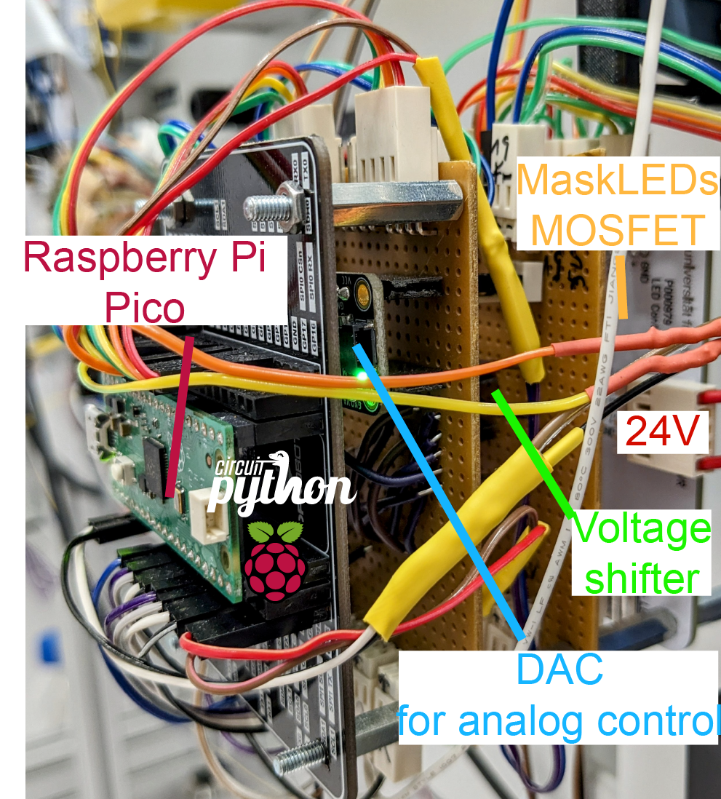

## Hardware Circuits
The FreiLaser system is configured using the Raspberry Pi Pico H, chosen for its pre-assembled header and compatibility
with the IO expansion board for simplified connections.  

### LaserCtrl circuit diagram
Wire the elements accordign to figure below

- Adafruit 757 voltage shifter is required if any components sending a trigger signal operate on other voltage than 3.3~V. 
- In our case some trigger signals (Trigger3-6) come from beam-breakers which operate on 5~V, thus the Adafruit 757 is wired to 5~V as high voltage (HV-pin). Please adopt the HV according to your needs.
- The DAC (MCP4728A4) allows to output complex waveforms or control the laser powever via an analog singal.
- DAC power (VCC-pin) is also wired to 5~V line as we would like our analog signal to range between 0-5~V. If other ranges are required, wire the VCC accordingly.
- The DAC is connected to the pico via I2C-protocol which enables fast changes of set voltage.
- The Pico can be powered via the USB serial or a 5~V input to the VBUS pin. WARNING: do not connect the VBUS if pico is powered via USB.
- Debug switch - switch to mount the disc of pico as a file system. If connected to GND, pico is recognized as a disc and files can be modified/copied on it. If not connected, the file system is mounted internally to log events to file. 
- Standalone switch - switch to operate in standalone mode (parameters via USB) or via UART. If pin is connected to GND, FreiLaser operates in standalone mode (\figref{fig:operating_principles}\textbf{A}). 
- Prime pin - connect to the source of the priming signal. 3.3~V only, otherwise wire through Adafruit 757. 
- CommEnable pin - Indicates whether the system is in an idle state and ready to receive new parameters. If HIGH, pico does not accept new parameters and only awaits trigger signals. Connect this pin to GND if this functionality is not required. This is disabled in standalone mode.
- Connect each laser's analog output (L1A to L4A) and laser enable signals (L1E to L4E) to your laser's corresponding channels.
- Connect the mask outputs (M1-4) to the masking circuit as required.

Example of the complete board after assembly using vertical stacking:

### MaskLED driving circuit
The masking circuit is an optional component of the FreiLaser system, utilized primarily in behavioral experiments 
where there is a risk that animals might perceive the laser light and use it as a cue. 
It is designed to drive LEDs to produce light flashes synchronized with laser pulses, effectively masking any potential
visual cues from the lasers.

